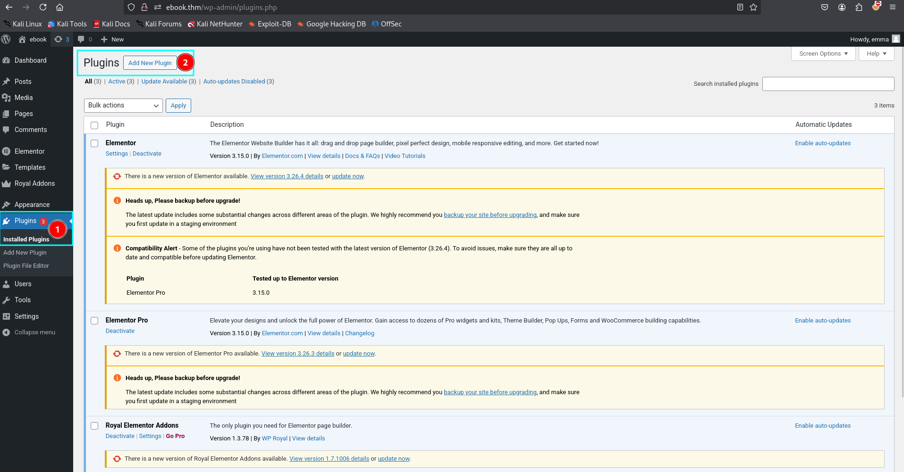
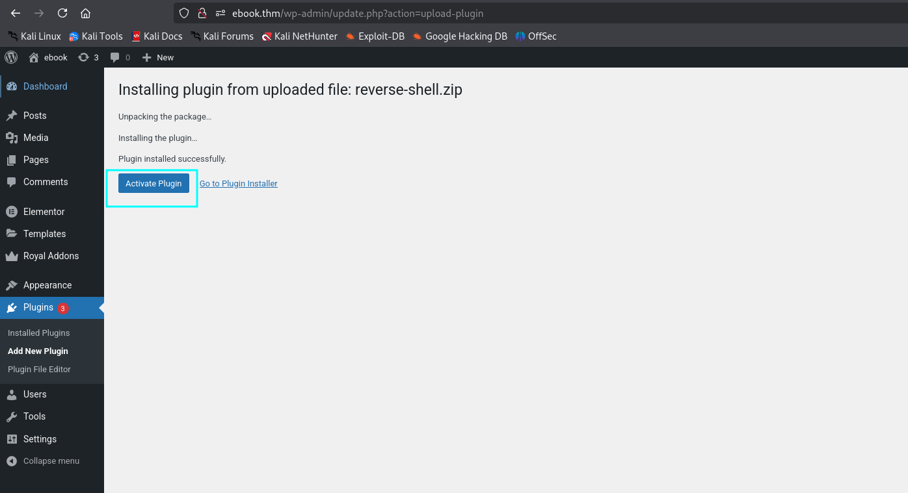
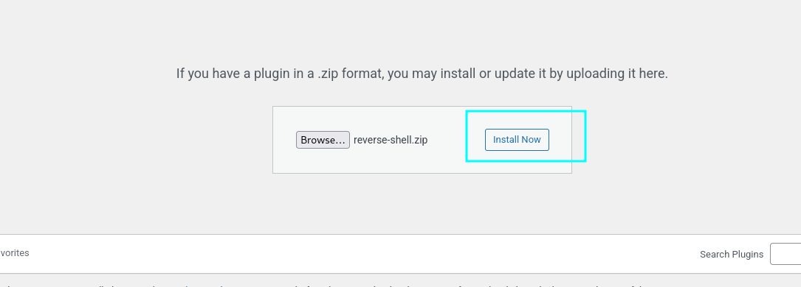
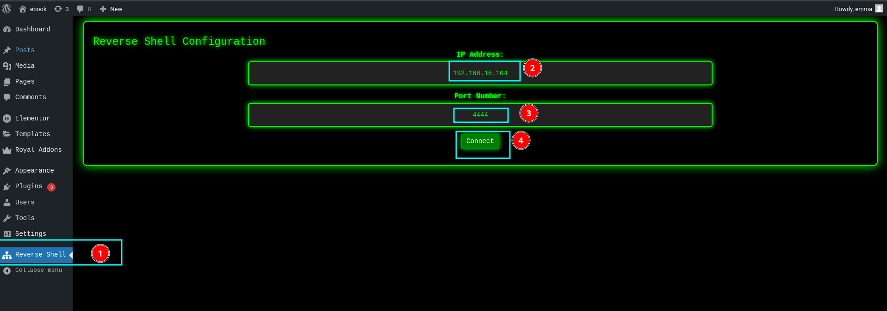
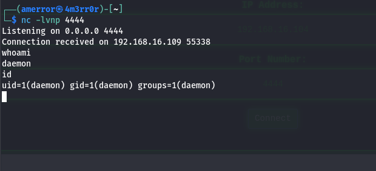

# Reverse Shell WordPress Plugin

A WordPress plugin that provides reverse shell functionality with a graphical user interface (GUI) for configuration. This plugin allows users to configure and initiate a reverse shell connection to a specified IP address and port.

## Features

- Simple GUI to configure IP address and port for the reverse shell.
- Easy-to-use settings page in the WordPress admin panel.
- Establishes a reverse shell connection to the provided IP and port.
- Provides real-time feedback on the connection status.

## Installation

1. Download the plugin file <a href="https://github.com/4m3rr0r/Reverse-Shell-WordPress-Plugin/releases/tag/v1.4.0" download="reverse-shell.zip">(`reverse-shell.zip`).</a>
2. Log in to your WordPress admin panel.
3. Navigate to **Plugins > Add New**.

    

4. Click the **Upload Plugin** button.
5. Upload the downloaded `reverse-shell.zip` file.

    
    
    

6. After uploading, click **Activate** to enable the plugin.

    

## Usage

1. After activation, a new menu option called **Reverse Shell** will appear in the WordPress admin dashboard.
2. Go to **Reverse Shell** in the admin menu to configure the plugin.
3. Enter the **IP Address** and **Port Number** where you want the reverse shell to connect.
4. Click **Connect** to establish the reverse shell connection.

    

5. If the connection is successful, commands from the server will be executed on the target machine, and the output will be sent back to your machine.

    

## Error Handling

- If the connection fails, an error message will be displayed with the details of the failure (e.g., incorrect IP, port, or network issues).

## Plugin Activation & Deactivation

- Upon activation, the plugin will set default values for IP and port: `127.0.0.1` and `4444`.
- Upon deactivation, the plugin will remove these settings from the database.

## Security Warning

**IMPORTANT:** This plugin provides reverse shell functionality, which can be extremely dangerous if misused. Use only in a controlled environment, such as a local testing setup or with explicit permission during penetration testing. Unauthorized use is illegal and unethical.

## Changelog

### Version 1.3
- Initial release with basic reverse shell functionality.

## License

This plugin is released under the [MIT License](LICENSE).

