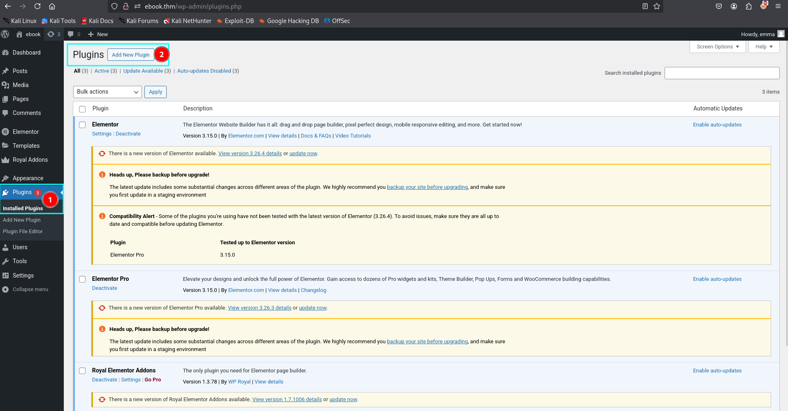
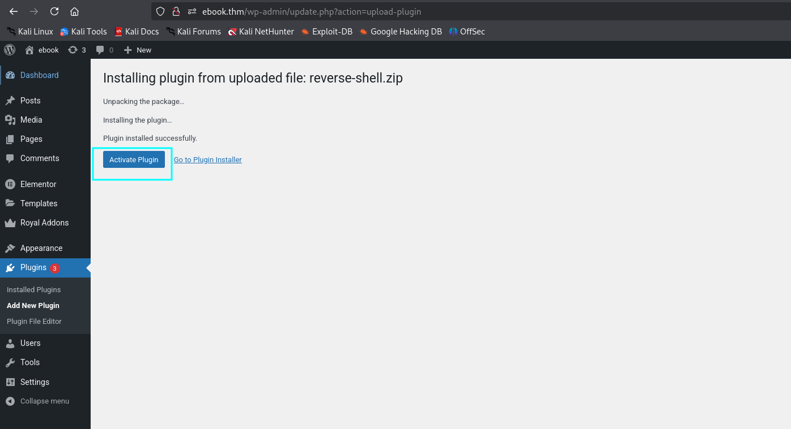
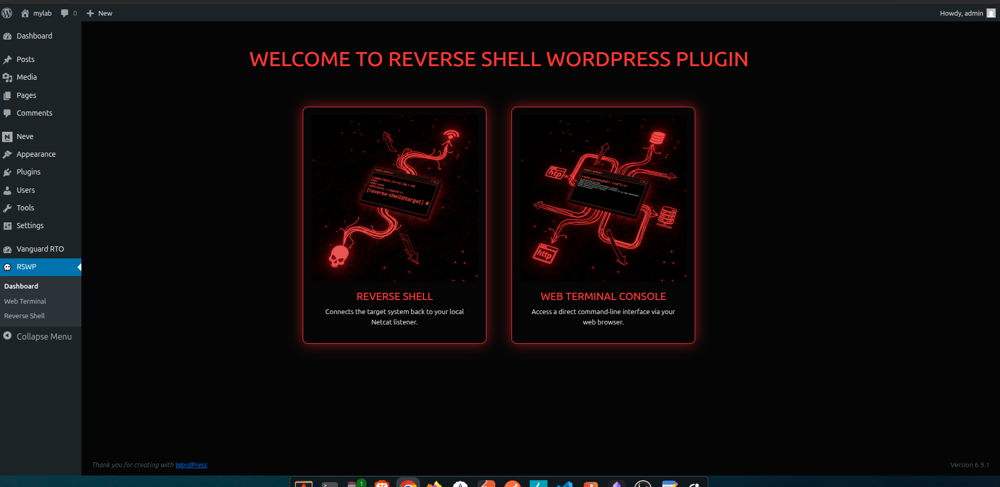
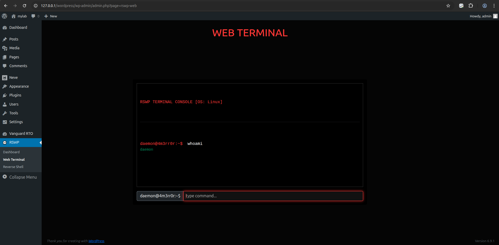
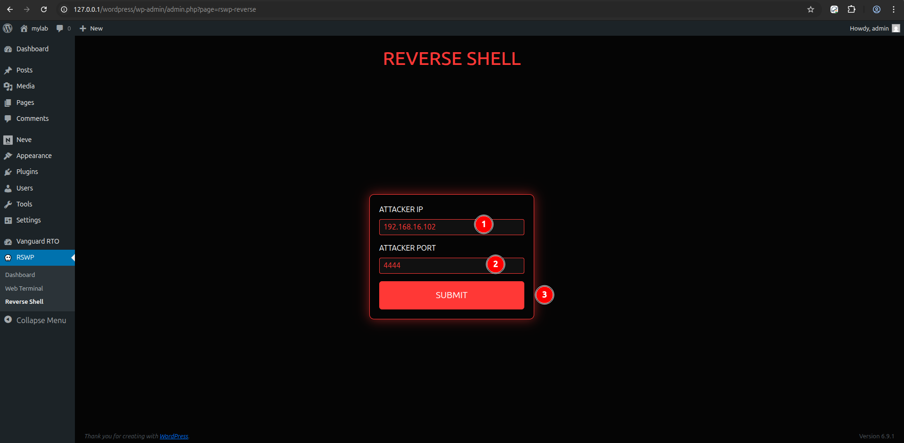

# Reverse Shell WordPress Plugin (RSWP)

A WordPress plugin that provides reverse shell functionality with a graphical user interface (GUI) for configuration. This plugin allows users to configure and initiate a reverse shell connection to a specified IP address and port.

---

## Version 2.0.0 Highlights

- Modular architecture (separate pages & assets)
- Web-based terminal (AJAX-powered command execution)
- Reverse shell engine with dual I/O pipe handling
- Cross-platform support (Linux / Windows)
- Bootstrap-powered modern UI
- WordPress-native integration (hooks, nonces, admin_post)
- Optimized asset loading (only on plugin pages)

---

## Features

### Web Terminal Console
- Execute system commands directly from the browser
- Real-time output rendering
- OS-aware prompt (`user@host`)
- AJAX-based secure request handling

### Reverse Shell Module
- Initiates outbound connection to listener
- Uses `proc_open` for interactive shell handling
- Supports:
  - `/bin/sh` (Linux/macOS)
  - `cmd.exe` (Windows)
- Non-blocking stream handling for stability

### Dashboard UI
- Clean navigation panel
- Modular page structure
- Interactive cards for quick access

---

## Installation

1. Download the plugin file <a href="https://github.com/4m3rr0r/Reverse-Shell-WordPress-Plugin/releases/download/v1.4.0/reverse-shell.v2.0.0.zip" download="reverse-shell.zip">(`reverse-shell.zip`).</a>
2. Log in to your WordPress admin panel.
3. Navigate to **Plugins > Add New**.

    


4. Click the **Upload Plugin** button.
5. Upload the downloaded `reverse-shell.zip` file.

    
    
    

6. After uploading, click **Activate** to enable the plugin.

    

---

## Usage

### 1. Access Panel
- Navigate to: **RSWP → Dashboard**



---


### 2. Web Terminal
- Go to: **RSWP → Web Terminal**
- Enter a command
- Press **Enter**
- Output will appear in real-time



---

### 3. Reverse Shell (Lab Use Only)

1. Start a listener on your machine:
   ```bash
   nc -lvnp 4444
   ```

2. Go to:
   **RSWP → Reverse Shell**

3. Enter:
   - Attacker IP
   - Port

4. Submit → connection will be attempted




---

## Technical Overview

### Command Execution (AJAX)
```php
add_action('wp_ajax_rswp_web_exec', 'rswp_handle_web_exec');
```

### Reverse Shell Engine
- Uses:
  - `fsockopen`
  - `proc_open`
  - `stream_select`
- Implements:
  - Full-duplex communication
  - Non-blocking streams

---

## Supported Environments

| OS        | Shell Used |
|----------|----------|
| Linux    | `/bin/sh` |
| macOS    | `/bin/sh` |
| Windows  | `cmd.exe` |

---

## License

This plugin is released under the [MIT License](LICENSE).
