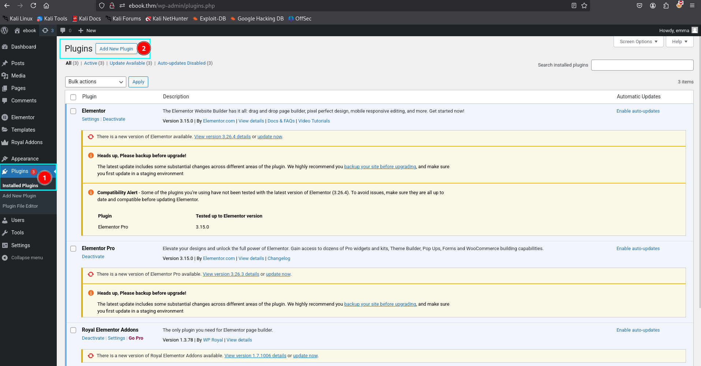
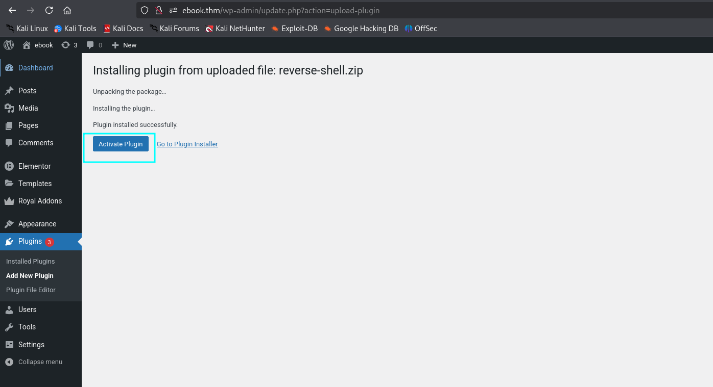
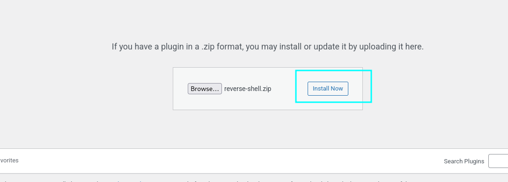
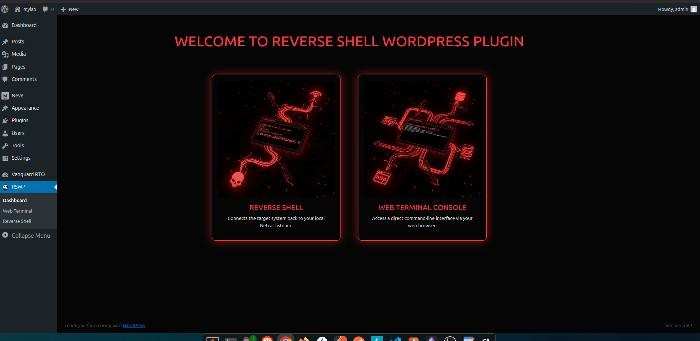
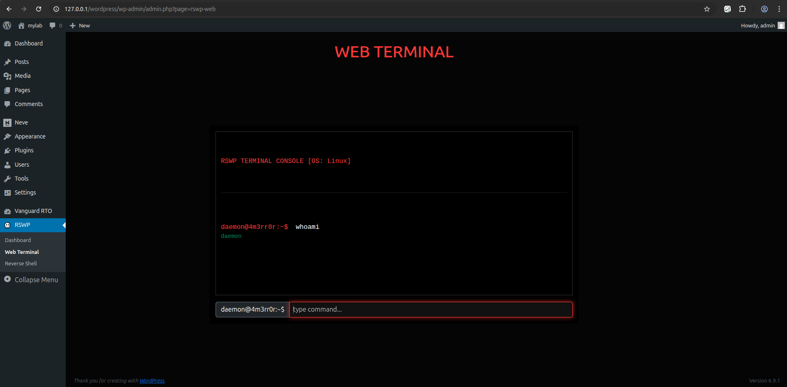
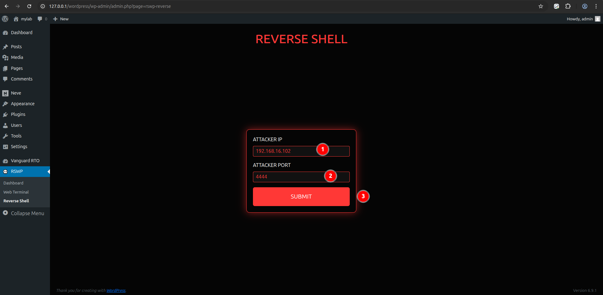
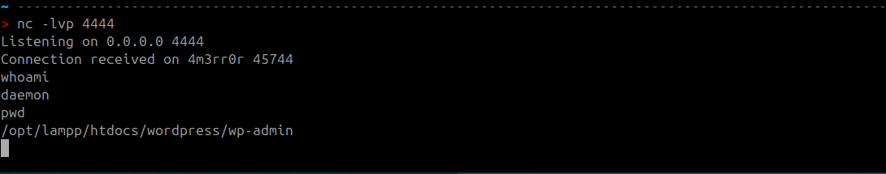

# Reverse Shell WordPress Plugin (RSWP)

A WordPress plugin that provides reverse shell functionality with a graphical user interface (GUI) for configuration. This plugin allows users to configure and initiate a reverse shell connection to a specified IP address and port.

---

## Features

### Web Terminal Console

* Execute system commands directly from the browser
* Real-time output rendering
* OS-aware prompt (`user@host`)
* AJAX-based request handling
* Restricted PHP environment detection
* Automatic detection of available PHP execution mechanisms

### Reverse Shell Module

* Initiates outbound connection to a listener
* Interactive shell handling
* Supports:

  * `/bin/sh` (Linux/macOS)
  * `cmd.exe` (Windows)
* Non-blocking stream handling for stability

### Dashboard UI

* Clean navigation panel
* Modular page structure
* Interactive cards for quick access

---

## Installation

1. Download the latest release from the [Releases](https://github.com/4m3rr0r/Reverse-Shell-WordPress-Plugin/releases) page.

2. Log in to your WordPress admin panel.

3. Navigate to **Plugins > Add New**.

    

4. Click the **Upload Plugin** button.

5. Upload the downloaded `reverse-shell_v3.0.0.zip` file.

    

    

6. After uploading, click **Activate** to enable the plugin.

---

## Usage

### 1. Access Panel

Navigate to:

**RSWP → Dashboard**



---

### 2. Web Terminal

Navigate to:

**RSWP → Web Terminal**

Enter a command and press **Enter**. The command output will be displayed in the terminal interface.



---

### 3. Reverse Shell

Navigate to:

**RSWP → Reverse Shell**

Configure the required connection parameters for your authorized testing environment.





> **Lab Use Only:** Use this functionality only on systems where you have explicit authorization to perform security testing.

---

## Technical Overview

### Command Execution (AJAX)

```php
add_action('wp_ajax_rswp_web_exec', 'rswp_handle_web_exec');
```

The Web Terminal uses a WordPress AJAX endpoint for handling administrative requests.

The plugin checks the PHP environment and detects available execution mechanisms, including configurations where commonly used PHP functions have been disabled.

### Reverse Shell Engine

The reverse-shell component uses PHP socket and process functionality for interactive communication.

Key components include:

* `fsockopen`
* `proc_open`
* `stream_select`

The implementation provides:

* Full-duplex communication
* Non-blocking streams
* Process I/O handling
* OS-specific shell support

---

## Restricted PHP Environments

RSWP can detect commonly restricted PHP execution functions and determine which supported execution mechanisms are available in the current environment.

This allows the plugin to work with a wider range of PHP configurations used in controlled security-testing environments.

---

## Supported Environments

| OS      | Shell Used |
| ------- | ---------- |
| Linux   | `/bin/sh`  |
| macOS   | `/bin/sh`  |
| Windows | `cmd.exe`  |

---

## Security Notice

This plugin is intended for authorized security research, penetration-testing laboratories, and CTF environments.

Do not use this software against systems without explicit authorization.

The author is not responsible for misuse, unauthorized access, damage, data loss, or other consequences resulting from the use of this software.

---

## License

This plugin is released under the [MIT License](LICENSE).

---

## Star History

<a href="https://www.star-history.com/?repos=4m3rr0r%2FReverse-Shell-WordPress-Plugin&type=date&legend=top-left">
 <picture>
   <source media="(prefers-color-scheme: dark)" srcset="https://api.star-history.com/chart?repos=4m3rr0r/Reverse-Shell-WordPress-Plugin&type=date&theme=dark&legend=top-left" />
   <source media="(prefers-color-scheme: light)" srcset="https://api.star-history.com/chart?repos=4m3rr0r/Reverse-Shell-WordPress-Plugin&type=date&legend=top-left" />
   
 </picture>
</a>
